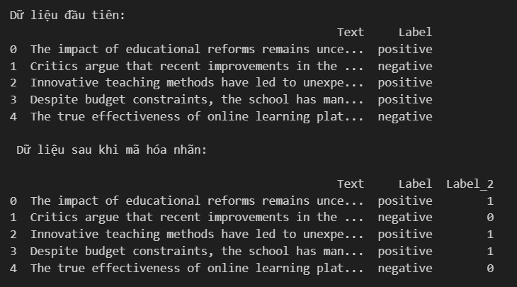
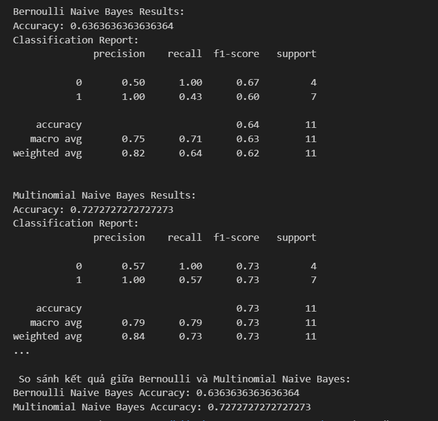
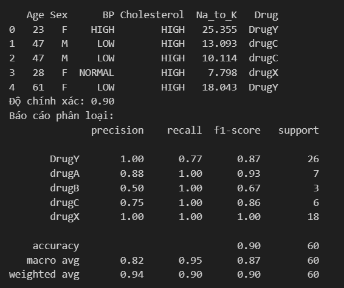

# 1. Công nghệ sử dụng:
Framework : numpy,pandas, sklearn , flask
# 2. Thuật toán:
Thuật toán Naive Bayes, Decision Tree
Bộ phân lớp Bayes là một giải thuật thuộc lớp giải thuật thống kê, nó có thể dự đoán xác suất của một phần tử dữ liệu thuộc vào một lớp là bao nhiêu. Phân lớp Bayes được dựa trên định lý Bayes (định lý được đặt theo tên tác giả của nó là Thomas Bayes)
# 3. Hiện thị kết quả lên website

# 4. Kết quả của 2 bài toán: 
# Bài toán 1

# Bài toán 2
