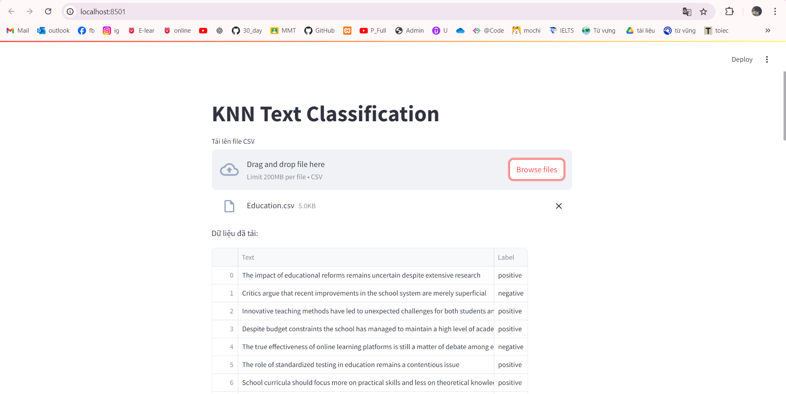
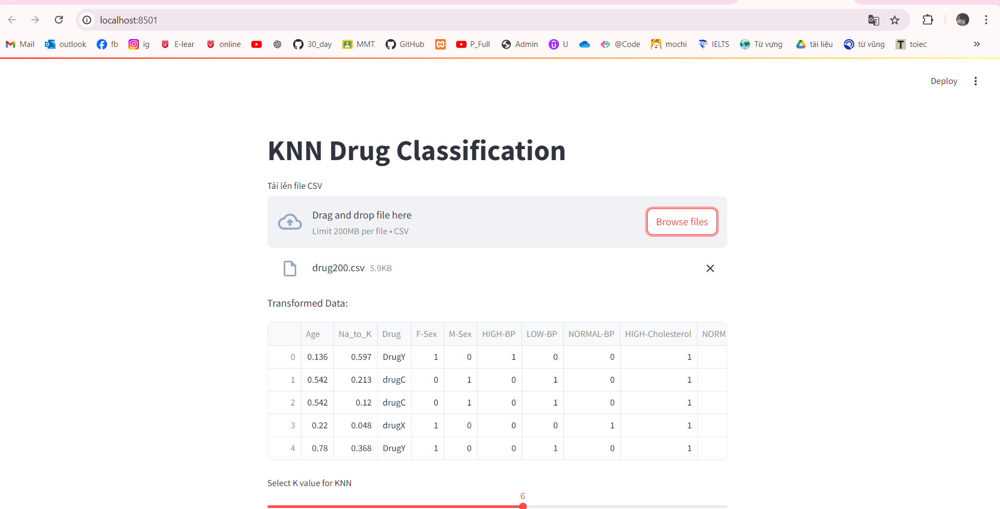
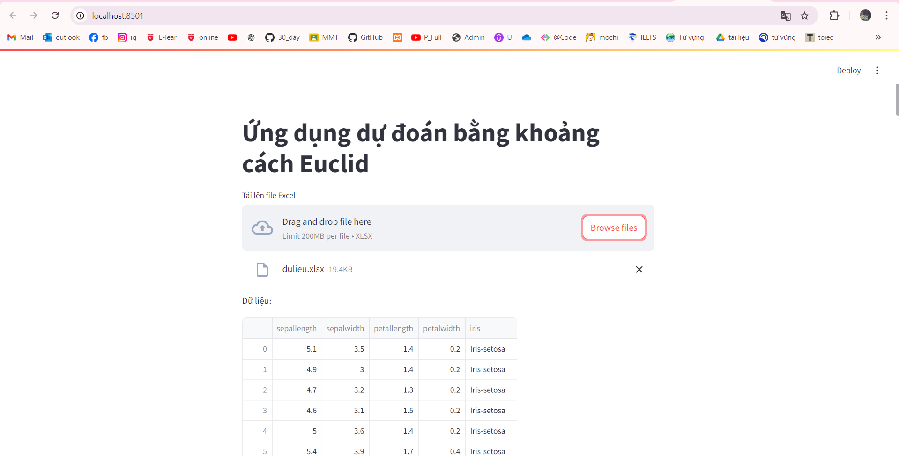

# 1. Công nghệ sử dụng
Framework : numpy,pandas, sklearn , flask ,streamlit
# 2. Thuật toán
K-Nearest Neighbors (KNN)
KNN là một thuật toán học máy không giám sát (non-parametric) thường được sử dụng cho bài toán phân loại và hồi quy. Nó dựa trên nguyên tắc rằng các điểm dữ liệu gần nhau trong không gian đặc trưng có khả năng có cùng nhãn hoặc giá trị.
# 3. Hiện thị kết quả lên website
Bài 1:

Bài 2:

Bài 3:
