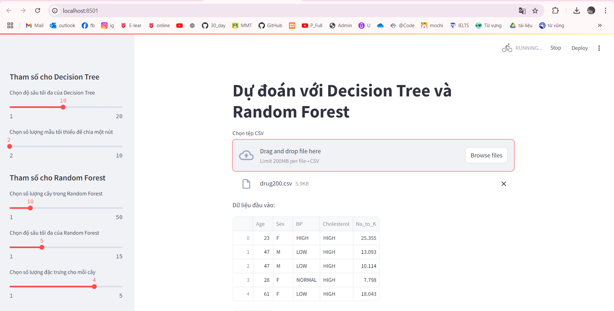

# 1.Công nghệ sử dụng
numpy: Thư viện xử lý mảng và tính toán số học hiệu quả, phổ biến trong lĩnh vực khoa học dữ liệu và học máy.
pandas: Thư viện xử lý dữ liệu, đặc biệt hữu ích cho việc thao tác với dữ liệu dưới dạng bảng (DataFrame).
sklearn.model_selection.train_test_split: Hàm này dùng để chia tập dữ liệu thành hai phần: tập huấn luyện (training set) và tập kiểm tra (test set), giúp đánh giá hiệu suất mô hình.
sklearn.metrics.accuracy_score: Hàm dùng để tính toán độ chính xác (accuracy) của mô hình, dựa trên tỉ lệ dự đoán đúng trên tổng số dự oán.
# 2 .Thuật toán
Decision Tree: Dùng để phân loại hoặc dự đoán giá trị. Cây quyết định xây dựng các nút và nhánh dựa trên các đặc trưng trong dữ liệu để đưa ra các quyết định hoặc phân loại.
Random Forest: Đây là một thuật toán phân loại và hồi quy sử dụng tập hợp nhiều cây quyết định. Mỗi cây trong rừng ngẫu nhiên được huấn luyện trên các mẫu dữ liệu ngẫu nhiên và các đặc trưng ngẫu nhiên, sau đó kết hợp kết quả từ các cây này để đưa ra quyết định cuối cùng. Thuật toán này thường có hiệu suất cao hơn so với một cây quyết định đơn lẻ vì giảm thiểu được hiện tượng overfitting (quá khớp).
# 3. Hiện thị kết quả lên website
