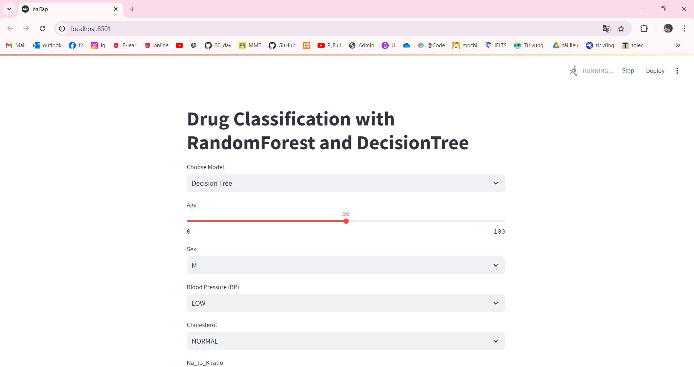
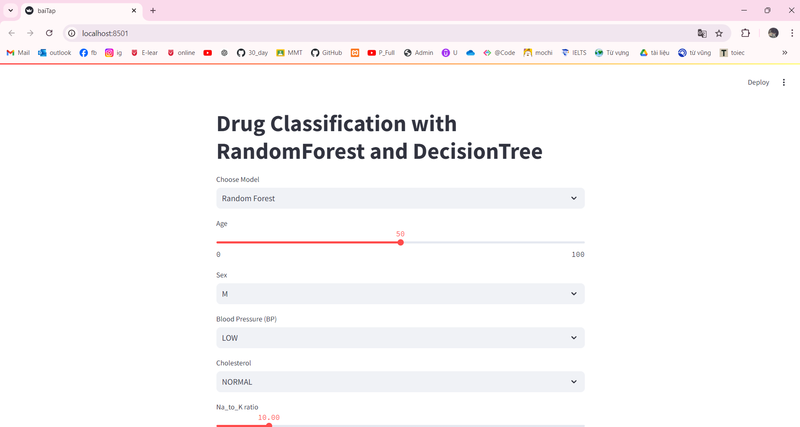

# 1. Công nghệ sử dụng
Framework : numpy,pandas, sklearn,streamlit
# 2. Thuật toán
Decision tree là một mô hình supervised learning, có thể được áp dụng vào cả hai bài toán classification và regression. Mỗi một nút trong (internal node) tương ứng với một biến; đường nối giữa nó với nút con của nó thể hiện một giá trị cụ thể cho biến đó.
Random là ngẫu nhiên, Forest là rừng, nên ở thuật toán Random Forest mình sẽ xây dựng nhiều cây quyết định bằng thuật toán Decision Tree, tuy nhiên mỗi cây quyết định sẽ khác nhau (có yếu tố random). Sau đó kết quả dự đoán được tổng hợp từ các cây quyết định.
# 3. Hiện thị kết quả lên website
Câu 1:

Câu 2:
