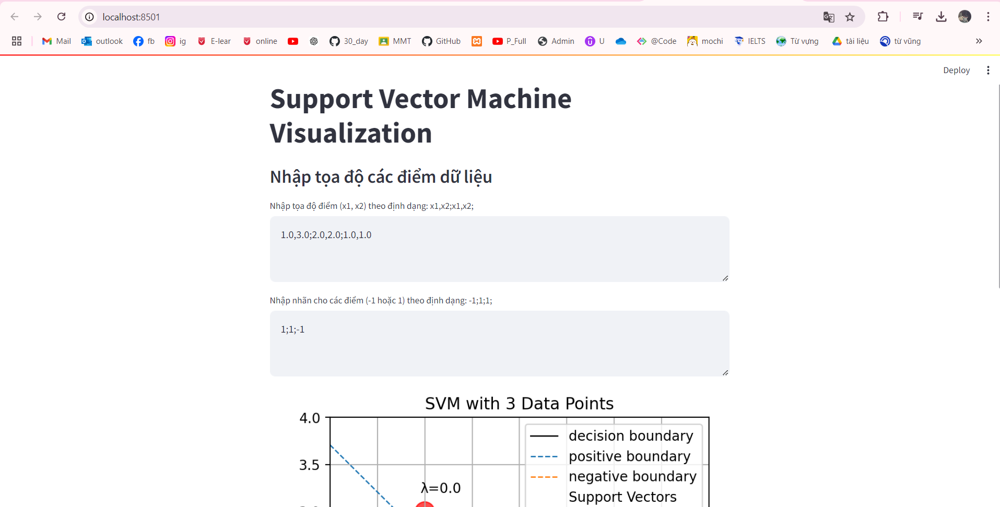
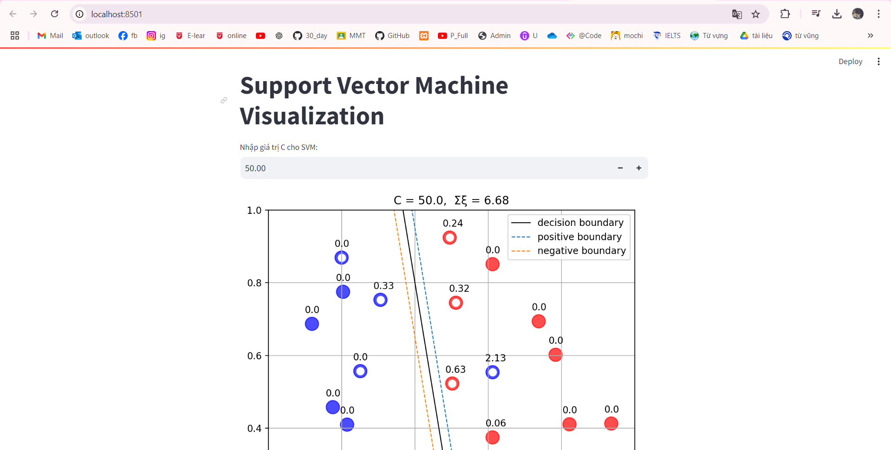

# 1.Công nghệ sử dụng
NumPy: Thư viện xử lý mảng và tính toán số học hiệu quả, phổ biến trong khoa học dữ liệu và học máy.
CVXOPT (Quadratic Programming - QP): Thư viện giải quyết bài toán lập trình tối ưu (quadratic programming), hữu ích trong việc tìm hệ số Lagrange (λ) cho SVM.
Matplotlib: Thư viện mạnh mẽ dùng để tạo đồ thị và hình ảnh 2D trong Python.
# 2 .Thuật toán
# Thuật toán câu 1
Tối ưu hoá để tìm ra giá trị λ cho cực tiểu hàm mục tiêu với việc sử dụng QP lưu ý rằng phải Thỏa mãn các ràng buộc là các λ đều lớn hơn hoặc bằng 0 và tổng của λiyi phải bằng 0.
Tính toán trọng số w bằng tổng của các λi nhân với yi và các điểm xi
Sau khi xác định được vector hỗ trợ sau đó bắt đầu tính b từ các vector hỗ trợ
Cuối cùng là biểu diễn trực quan đồ thị bằng phương trình w0x1 + w1x2 + b ‎ =  0 sau khi chạy plt.show() từ thư viện matplotlib ta thấy biểu đồ các biên dương âm song song cách đều nhau 1 khoảng gọi là margin
# Thuật toán câu 2
Sử dụng QP từ thư viện cvxopt để tìm các giá trị λ tối ưu
weight vector and bias: Khi có giá trị λ mình bắt đầu tính vector trọng số w và b để ra được đường phân tách
Tìm các điểm dữ liệu có ảnh hưởng tới đường phân tách được gọi là vector hỗ trợ (support vectors)
Sau đó sử dụng plt.show() từ thư viện matplotlib để trực quan hoá dữ liệu, các vector hỗ trợ, và các đường biên dương âm và margin
Slack value: tính toán và hiển thị các biến slack(ξ) để đo các điểm nằm ngoài margin
# 3. Hiện thị kết quả lên website
Câu 1:

Câu 2:

