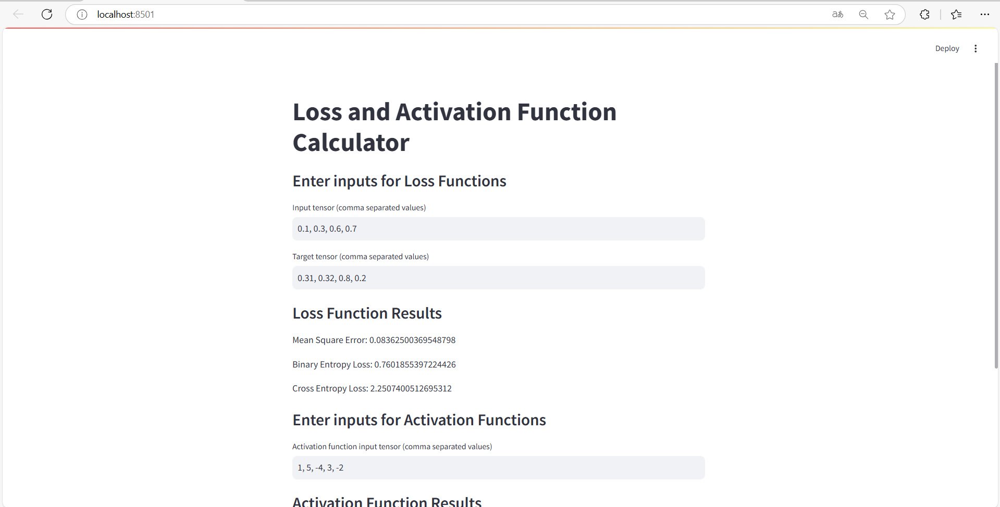
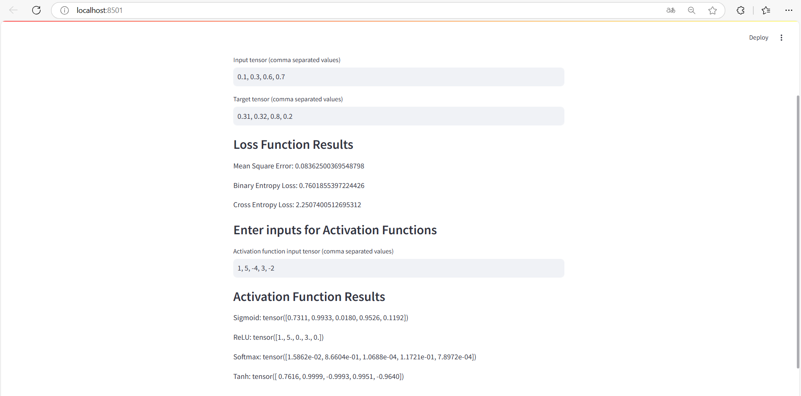

## 1. Công Nghệ Sử Dụng
NumPy: Thư viện xử lý mảng và tính toán số học hiệu quả, phổ biến trong khoa học dữ liệu và học máy.
CVXOPT: Thư viện giải quyết bài toán lập trình tối ưu (Quadratic Programming - QP), hữu ích trong việc tìm hệ số Lagrange (λ) cho Support Vector Machine (SVM).
Matplotlib: Thư viện mạnh mẽ dùng để tạo đồ thị và hình ảnh 2D trong Python.

## 2. Thuật Toán

### Thuật Toán Câu 1
Tối ưu hóa để tìm ra giá trị λ cho cực tiểu hàm mục tiêu với điều kiện các λ phải lớn hơn hoặc bằng 0 và tổng của λiyi phải bằng 0.
Tính toán trọng số w bằng tổng của các λi nhân với yi và các điểm xi.
Xác định vector hỗ trợ, sau đó tính b từ các vector hỗ trợ.
Cuối cùng, biểu diễn đồ thị bằng phương trình \( w_0x_1 + w_1x_2 + b = 0 \). Sau khi chạy `plt.show()` từ thư viện Matplotlib, ta thấy biểu đồ các biên dương âm song song cách đều nhau 1 khoảng, gọi là margin.

### Thuật Toán Câu 2
Sử dụng QP từ thư viện CVXOPT để tìm các giá trị λ tối ưu.
Vector trọng số và bias: Khi có giá trị λ, tính vector trọng số w và b để tìm đường phân tách.
Tìm các điểm dữ liệu ảnh hưởng tới đường phân tách, được gọi là vector hỗ trợ (support vectors).
Sử dụng `plt.show()` từ thư viện Matplotlib để trực quan hóa dữ liệu, các vector hỗ trợ, và các đường biên dương âm cùng với margin.
Tính toán và hiển thị các biến slack (ξ) để đo các điểm nằm ngoài margin.
# 3. Hiện thị kết quả lên website
Câu 1:

Câu 2:

