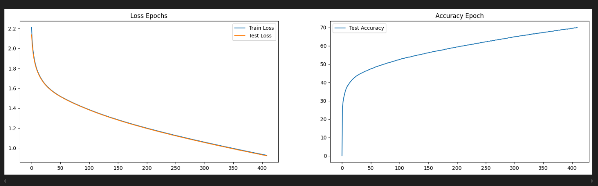

# Công nghệ sử dụng
torch là một thư viện mã nguồn mở hỗ trợ học sâu và tính toán khoa học
matplotlib.pyplot là một module của Matplotlib giúp vẽ đồ thị và biểu đồ dữ liệu.
numpy là thư viện cung cấp các công cụ tính toán mạnh mẽ với mảng (arrays) và phép tính toán khoa học.
SGD (Stochastic Gradient Descent) là một thuật toán tối ưu hóa trong học máy, được sử dụng để điều chỉnh trọng số của mô hình nhằm giảm thiểu hàm lỗi
torch.nn cung cấp các công cụ cần thiết để xây dựng và định nghĩa các mô hình học sâu
ransforms cung cấp các công cụ để biến đổi và chuẩn hóa dữ liệu hình ảnh (như chuyển đổi sang tensor, thay đổi kích thước, chuẩn hóa)
torch.device xác định thiết bị phần cứng sẽ được sử dụng để thực thi các phép tính
# Thuật toán sử dụng
MLP (Multi-Layer Perceptron), Z-Score Scaling và Min-Max Scaling
ảnh có kích thước (3, 32, 32) được chuyển thành một vector 1D sau đó thông qua sử lý đầu vào và đầu ra thì qua thuật toán SGD huấn luyện để cập nhật trọng số của mô hình qua từng bước huấn luyện sau đó đến cross để xem độ mất mát cảu bài toán sau đó đánh giá bằng z-score và Min-max
# Kết quả
Độ chính xác

Biểu đồ

Test
