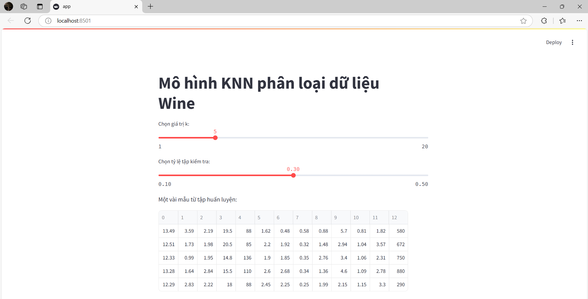
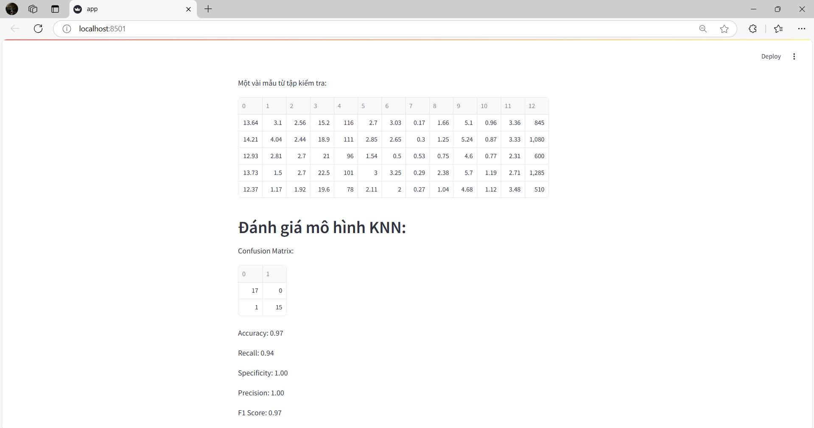

# 1.Công Nghệ Sử Dụng
Scikit-learn: Thư viện học máy rất phổ biến trong Python, cung cấp nhiều công cụ để phân loại, hồi quy và phân cụm. Pandas: Thư viện mạnh mẽ cho việc xử lý và phân tích dữ liệu, giúp đọc và thao tác với dữ liệu dạng bảng dễ dàng. Seaborn: Thư viện trực quan hóa dữ liệu dựa trên Matplotlib, cho phép tạo ra các biểu đồ đẹp mắt và thông minh.

# 2.Thuật Toán
Sử dụng thuật toán K-Means để phân cụm dữ liệu thành các nhóm. Đầu tiên, chọn số lượng cụm k và khởi tạo vị trí của k centroid ngẫu nhiên. Tiến hành gán các điểm dữ liệu vào cụm gần nhất bằng cách tính khoảng cách từ mỗi điểm đến các centroid. Cập nhật vị trí của các centroid bằng cách tính trung bình của tất cả các điểm trong mỗi cụm. Lặp lại quá trình gán và cập nhật cho đến khi vị trí centroid không còn thay đổi nhiều. Cuối cùng, biểu diễn kết quả phân cụm trên biểu đồ với các điểm màu khác nhau cho từng cụm.

# 3.Hiện Thị Kết Quả Lên Website

