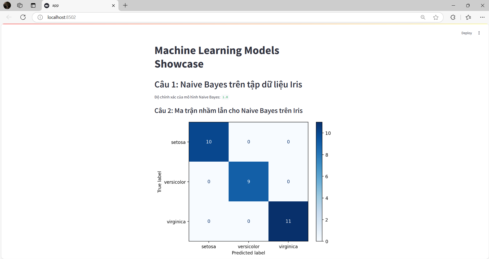
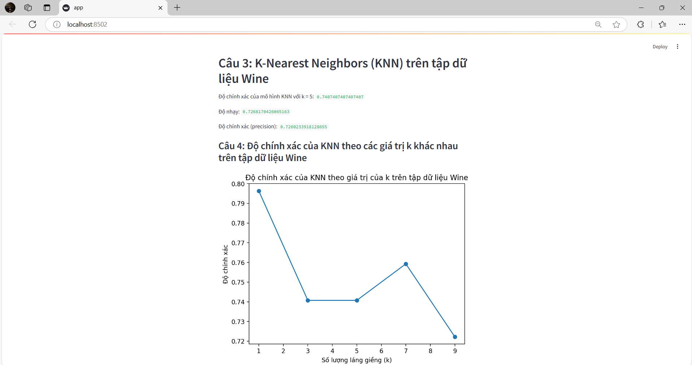
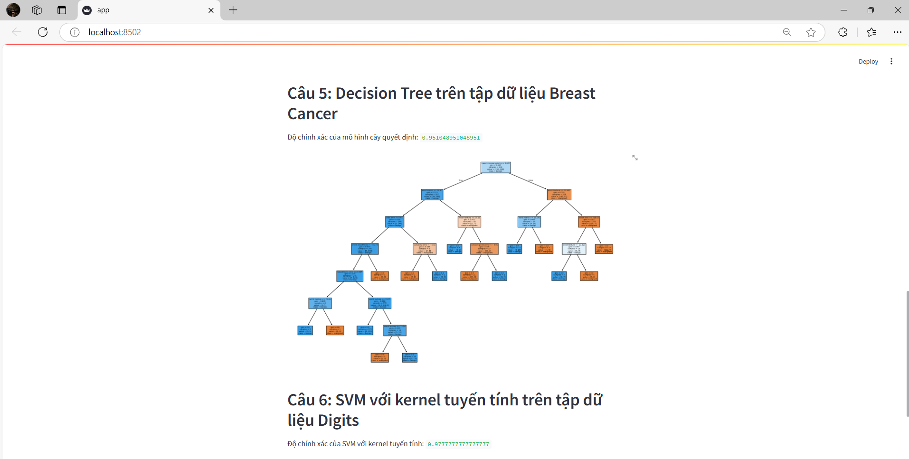
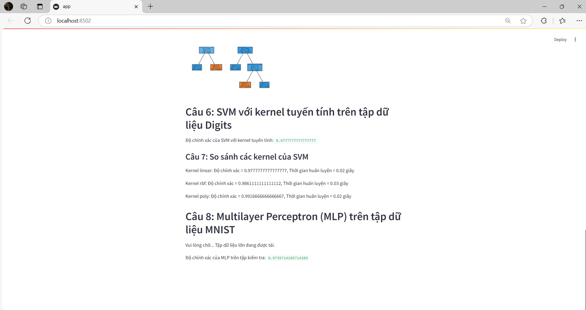

# Machine Learning Models Showcase
# 1.Công Nghệ Sử Dụng
- **Streamlit**: Thư viện Python cho việc tạo ứng dụng web nhanh chóng và dễ dàng cho máy học.
- **Scikit-learn**: Thư viện cho học máy với nhiều mô hình và công cụ.
- **Matplotlib**: Thư viện vẽ đồ thị cho Python.
- **NumPy**: Thư viện cho xử lý mảng và tính toán khoa học.
- **Pandas**: Thư viện cho xử lý dữ liệu dạng bảng.
# 2.Thuật toán sử dụng
- Naive Bayes
- K-Nearest Neighbors (KNN)
- Cây quyết định (Decision Tree)
- Support Vector Machine (SVM)
- Multilayer Perceptron (MLP)
# Các Tính Năng
- **Naive Bayes**: Đánh giá độ chính xác trên tập dữ liệu Iris và hiển thị ma trận nhầm lẫn.
- **K-Nearest Neighbors (KNN)**: Tính toán độ chính xác, độ nhạy và độ chính xác cho mô hình KNN trên tập dữ liệu Wine. Cung cấp khả năng thử nghiệm với các giá trị k khác nhau.
- **Cây quyết định**: Đánh giá độ chính xác và hiển thị cây quyết định cho tập dữ liệu Breast Cancer.
- **Support Vector Machine (SVM)**: Đánh giá độ chính xác của mô hình SVM với kernel tuyến tính và so sánh độ chính xác của các kernel khác nhau.
- **Multilayer Perceptron (MLP)**: Đánh giá độ chính xác trên tập dữ liệu MNIST.

# 3.Hiện thị hình ảnh

